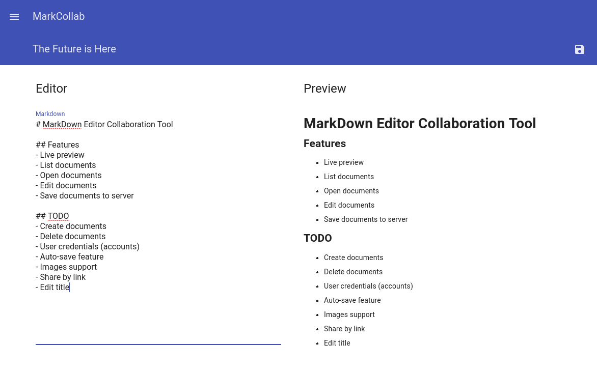
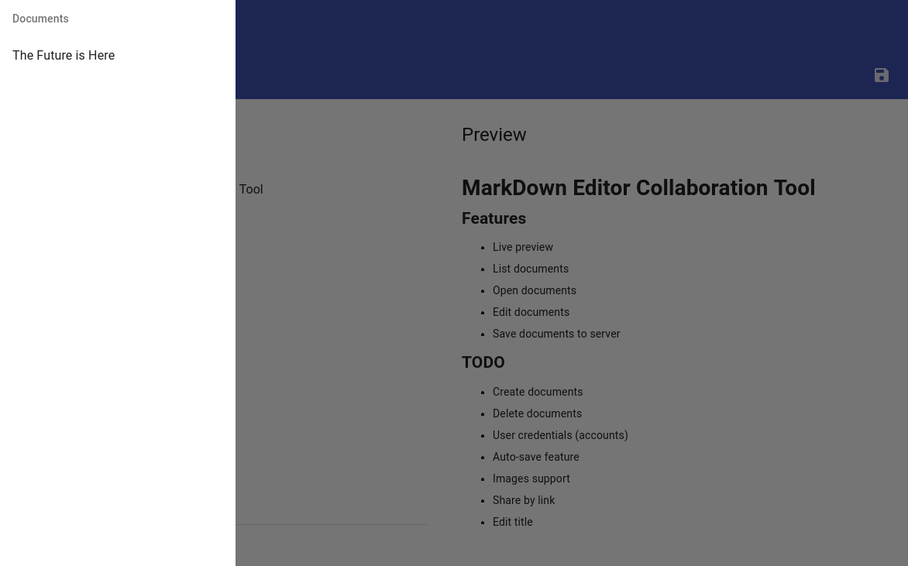

# !!!!!!!!!!!!!!!!!!!!!!!!!!!!
# Repo moved here 👉 https://github.com/SelfRef/mark-collab
# !!!!!!!!!!!!!!!!!!!!!!!!!!!!

# MarkCollab Editor

* @Author: TimsManter
* @AuthorSite: [TimsManter.NET](http://timsmanter.net/)
* @CreateDate: 2017-06
* @Editor: Visual Studio Code
* @Language: TypeScript
* @Framework: Vue.js
* @Locale: en_US
* @License: n/a yet
* @Status: Dev | Active

<!-- TOC -->

- [Overview](#overview)
- [Screenshots](#screenshots)

<!-- /TOC -->

## Overview

MarkCollab is a simple collaboration tool for creating various types of documents using Markdown syntax. The main idea is to create a self-hosted Web Application that contains everything to create Markdown documents by many people in the same time.

## Screenshots

